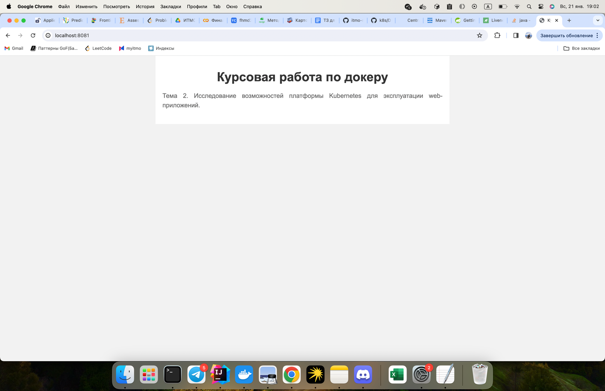
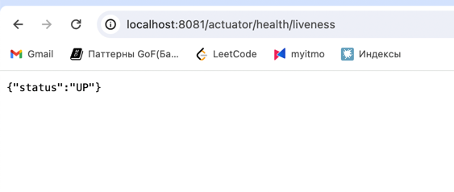
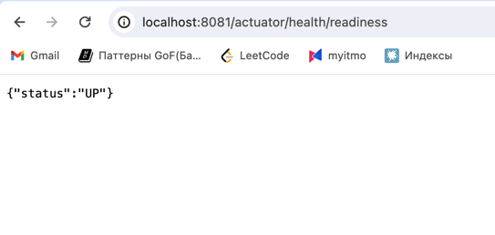
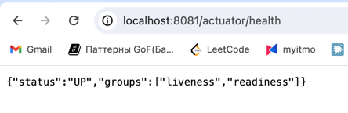

# Тема 2. Исследование возможностей платформы Kubernetes для эксплуатации web-приложений.

Было написано небольшое приложение на spring-boot, которое умеет отдавать html страничку. Была подключена зависимость spring-boot-starter-actuator, которая умеет из коробки раздавать health checks.

Приложение собрано в виде докер образа.
```shell
docker build . -t ansoldatov/k8s-coursework:1.0.0
docker run -p 8081:8081 ansoldatov/k8s-courseworc:1.0.0
```

Image выложен на Docker Hub.

```shell
docker push  ansoldatov/k8s-coursework:1.0.0
```

Установка Deployment в кластер:

```shell
kubectl apply --filename deploy/deployment.yml --namespace default 
```

Проброс портов:

```shell
kubectl port-forward --address 0.0.0.0 deployment/web 8081:8081
```

Запущенное приложение:



Пример ответа liveness пробы.



Пример ответа readiness пробы.




Общий ответ приложения на health check.

